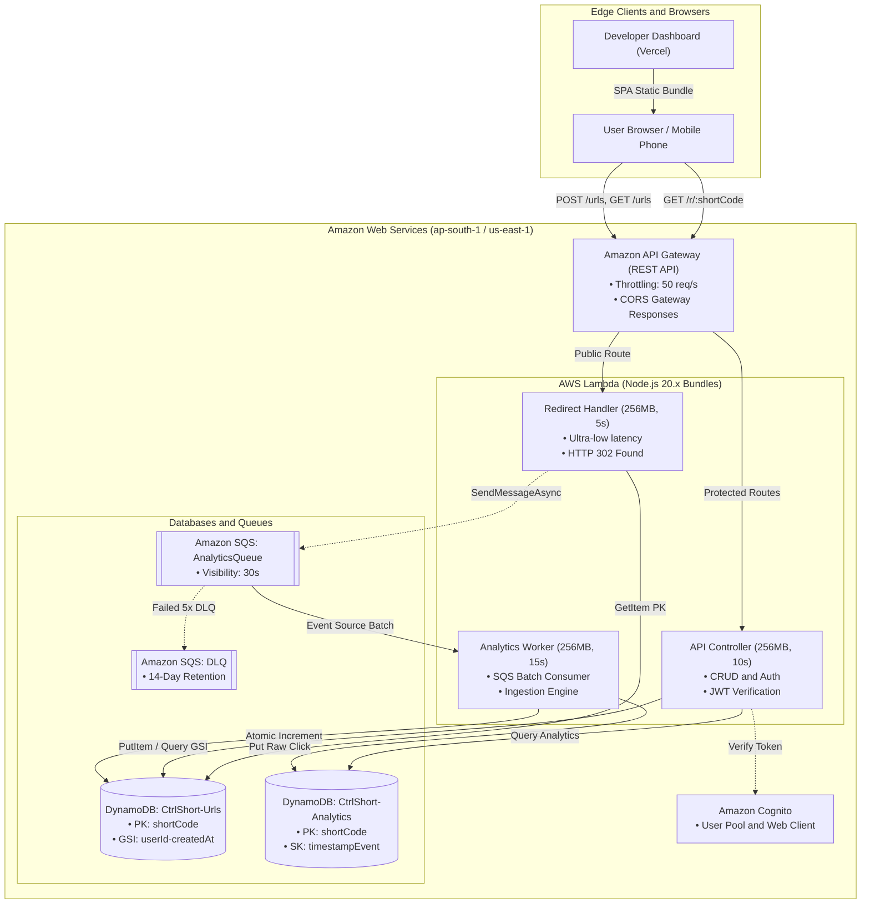
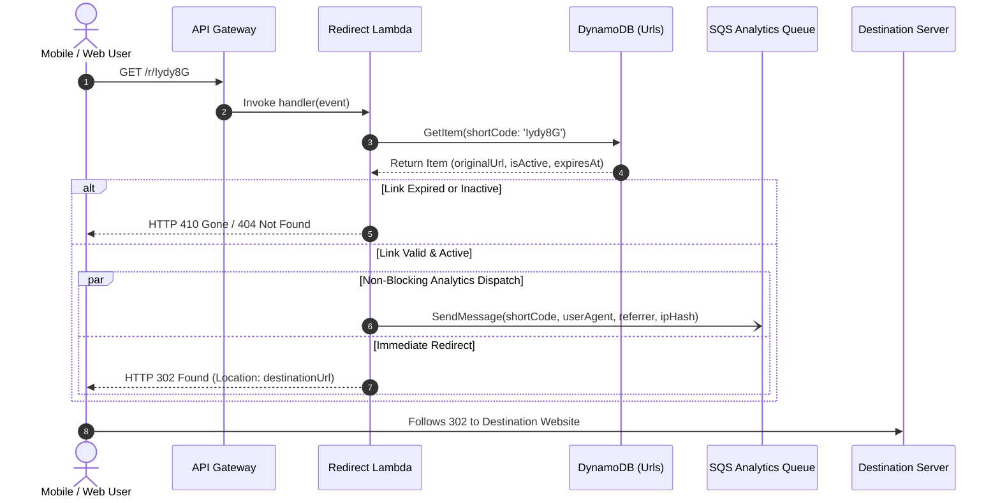
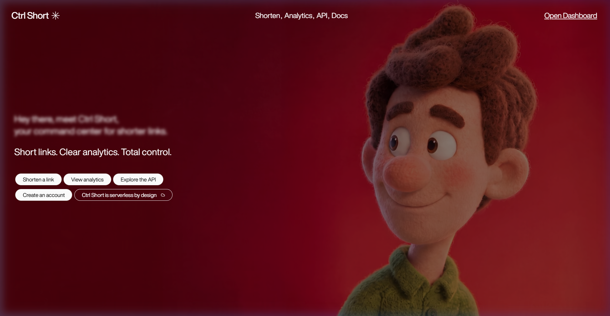
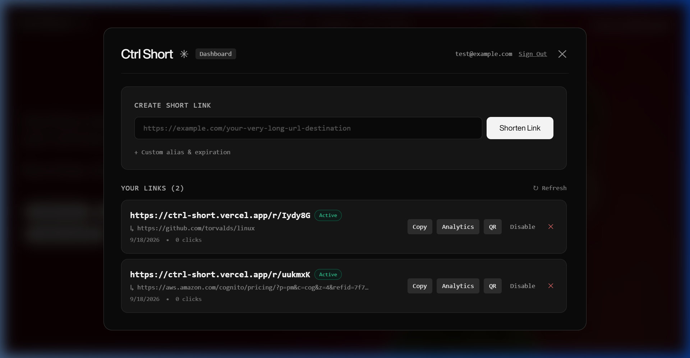
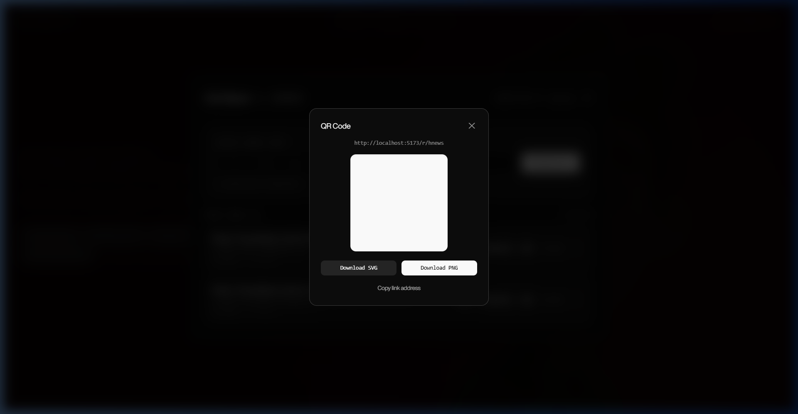

<div align="center">

# ⚡ Ctrl Short

### *High-Performance Serverless URL Shortener & Real-Time Analytics Platform*

A minimalist, developer-focused, 100% serverless link management engine built for extreme speed, privacy-first analytics, and zero idle cloud cost.

[](https://ctrl-short.vercel.app/)
[](https://aws.amazon.com/)
[](https://react.dev/)
[](https://vitejs.dev/)
[](https://aws.amazon.com/dynamodb/)
[](https://aws.amazon.com/sqs/)
[](LICENSE)
[](tests/)

---

[Explore Live Demo](https://ctrl-short.vercel.app/) • [Architecture Overview](#-architecture--system-workflow) • [API Reference](#-api-documentation) • [Quickstart Guide](#-quickstart--installation-guide) • [Report Bug](https://github.com/tusharkkp/Ctrl-Short/issues)

</div>

---

## 📑 Table of Contents

- [The Problem \& Why It Matters](#-the-problem--why-it-matters)
- [Key Features](#-key-features)
- [Architecture \& System Workflow](#-architecture--system-workflow)
- [Interactive Screenshots](#-interactive-screenshots)
- [Tech Stack \& Architectural Rationale](#-tech-stack--architectural-rationale)
- [Folder Structure](#-folder-structure)
- [API Documentation](#-api-documentation)
- [Environment Variables](#-environment-variables)
- [Quickstart \& Installation Guide](#-quickstart--installation-guide)
  - [Mode 1: Zero-Cloud Offline Development](#mode-1-zero-cloud-offline-development-recommended-for-local-testing)
  - [Mode 2: Production AWS Cloud Deployment (CDK)](#mode-2-production-aws-cloud-deployment-via-cdk)
  - [Mode 3: Frontend Deployment to Vercel](#mode-3-frontend-deployment-to-vercel)
- [Performance \& Denial-of-Wallet Security](#-performance--denial-of-wallet-security)
- [Roadmap \& Future Scope](#-roadmap--future-scope)
- [Contributing](#-contributing)
- [License](#-license)
- [Author \& Credits](#-author--credits)

---

## 🎯 The Problem & Why It Matters

Traditional URL shorteners suffer from structural inefficiencies that compromise user experience, privacy, and cost:

1. **Synchronous Analytics Bottlenecks:** Most URL shorteners write click statistics to a relational database synchronously during the HTTP redirect request. Under viral traffic spikes, database connection pools exhaust, locking queries and inflating redirect latency from milliseconds to seconds.
2. **Persistent Server Costs (The Idle Tax):** Traditional monolithic backend servers (Node/Express or Django on VMs) incur 24/7 compute billing regardless of traffic volume. A student or startup project pays for idle CPU cycles even with zero visitors.
3. **Invasive Privacy Practices:** Commercial link management platforms harvest raw IP addresses, user cookies, and personal telemetry, creating compliance headaches under GDPR, CCPA, and PECR.
4. **Collision Risks & Ugly Slugs:** Naive random string generators or auto-incrementing integer IDs suffer from birthday paradox collision spikes and expose database row counts to competitive scraping.

### 💡 How Ctrl Short Solves This

* **Decoupled Asynchronous Queue Pipeline:** HTTP 302 redirects execute in **sub-50ms** via Amazon DynamoDB primary key lookups. Click metrics are non-blockingly dispatched to **Amazon SQS** and ingested asynchronously by an isolated worker Lambda.
* **Pure Serverless ($0.00 Idle Cost):** Built on AWS Lambda, DynamoDB (Pay-Per-Request), and SQS, Ctrl Short scales to zero. It costs **$0.00/month** when idle and operates entirely within the AWS Free Tier.
* **Privacy by Design:** Zero raw IP storage. Daily-salted SHA-256 cryptographic hashing calculates unique daily visitor counts without persisting PII.
* **Cryptographic Base62 Generation:** Uniform cryptographic byte distribution delivers short, clean, collision-resistant 6-character slugs with automated collision retry guards.

---

## ✨ Key Features

### 🚀 Core URL Engine & Redirection
* **Ultra-Low-Latency HTTP 302 Redirects:** Average execution time under **40ms** using DynamoDB single-digit millisecond key-value lookups.
* **Collision-Resistant Base62 Engine:** Cryptographically generated 6-character short codes drawn from a 62-character alphabet ($62^6 \approx 56.8\text{ billion}$ unique combinations).
* **Custom Alias Support:** User-defined branded vanity slugs (`/r/launch`, `/r/portfolio`) with strict character validation and reserved-route collision guards.
* **Automatic Expiration (TTL):** Built-in TTL scheduling (1 hour, 24 hours, 7 days, 30 days, or permanent). DynamoDB natively purges expired records at zero compute cost.

### 📊 Real-Time Analytics & Developer Dashboard
* **Non-Blocking Ingestion:** Click events never delay the user redirect. SQS buffers millions of events during traffic bursts with an automated Dead-Letter Queue (DLQ).
* **Rich Categorized Insights:** Tracks total clicks, unique visitors, browser distribution (Chrome, Firefox, Safari, Edge), device breakdown (Mobile, Desktop, Tablet), operating system, and top referrers.
* **Status Toggles & Link Management:** Instantly pause, reactivate, or permanently delete links from the control panel.

### 📱 Developer Utilities & Aesthetic Interface
* **High-Contrast QR Code Generator:** Instantly renders black/white scannable QR SVG matrices with one-click **PNG download** for print and digital campaigns.
* **Developer-Centric Monochrome Aesthetic:** Minimal, brutalist dark-mode landing page featuring interactive mouse-scrubbed background video, typing terminal animations, and zero heavy component libraries.
* **Multi-Device & LAN Host Awareness:** Short links automatically adapt to host origins across local dev, LAN IP testing on mobile phones, and production Vercel domains.

---

## 🏛 Architecture & System Workflow

Ctrl Short is engineered with a **cloud-native, event-driven serverless architecture** that isolates latency-sensitive public routing from asynchronous analytical computations.

### High-Level Cloud Architecture



### Redirection & Analytics Sequence Flow



---

## 📸 Interactive Screenshots

<div align="center">

### 1. Minimalist Developer Landing Page
*Full-screen video background with interactive scrub controls and command-line typing engine.*


---

### 2. Real-Time Developer Control Panel
*Manage links, inspect click metrics, toggle active status, and configure custom aliases.*


---

### 3. High-Contrast QR Code Generator
*Instant black/white SVG modules with one-click PNG image download for digital/print campaigns.*


</div>

---

## 🛠 Tech Stack & Architectural Rationale

| Layer | Technology | Architectural Rationale |
| :--- | :--- | :--- |
| **Frontend Framework** | **React 19** | Latest React paradigm with optimized concurrent rendering, hooks, and clean state transitions. |
| **Language** | **TypeScript 5.x** | End-to-end typed contracts across API requests, responses, database models, and cloud infrastructure. |
| **Build Tool** | **Vite 6** | Sub-second Hot Module Replacement (HMR) and optimized tree-shaken ESM production bundles. |
| **Styling** | **Tailwind CSS 3.4** | Utility-first, zero-runtime CSS engine delivering a bespoke developer dark-mode aesthetic without component library overhead. |
| **Cloud Infrastructure** | **AWS CDK (TypeScript)** | Infrastructure as Code (IaC) enabling reproducible, version-controlled cloud environments and clean 1-command teardown (`cdk destroy`). |
| **Compute** | **AWS Lambda (Node.js 20)** | Zero idle cost, sub-50ms execution times, automatic horizontal scaling, pre-bundled via `esbuild` for minimal cold starts. |
| **Database** | **Amazon DynamoDB** | Predictable single-digit millisecond latency at any scale, native TTL auto-deletion, and atomic click counter increments (`ADD totalClicks :inc`). |
| **Asynchronous Queue** | **Amazon SQS + DLQ** | Decouples redirect latency from analytics processing, absorbs viral traffic spikes, and guarantees zero data loss via Dead-Letter Queues. |
| **API Gateway** | **AWS REST API Gateway** | Managed edge gateway providing CORS enforcement, DDoS rate-limiting, and payload validation. |
| **Authentication** | **Amazon Cognito** | Enterprise-grade user pool with SRP authentication, JWT validation, and seamless guest developer session bypass. |
| **Testing Suite** | **Vitest** | Blazing-fast unit testing running URL validation, Base62 distribution, and cryptographic hashing suites. |

---

## 📂 Folder Structure

```text
ctrl-short/
├── backend/                        # Cloud & Local Serverless Backend
│   ├── handlers/
│   │   ├── api.ts                  # REST API controller (CRUD, auth, analytics)
│   │   ├── redirect.ts             # High-speed HTTP 302 redirect Lambda
│   │   └── analytics.ts            # SQS consumer batch worker
│   ├── lib/
│   │   ├── analytics-helper.ts     # User-Agent parser, referrers, SHA-256 IP hasher
│   │   ├── auth.ts                 # Cognito JWT verifier & guest token handler
│   │   ├── dynamodb.ts             # DynamoDB SDK client, queries, atomic writes
│   │   ├── short-code.ts           # Collision-resistant Base62 generator
│   │   ├── sqs.ts                  # SQS dispatcher & local in-memory event bus
│   │   └── validator.ts            # Protocol whitelist, length & loopback blocker
│   ├── types/                      # Shared backend TypeScript data contracts
│   └── local-server.ts             # Offline Express development server
│
├── infra/                          # Infrastructure as Code (AWS CDK)
│   ├── bin/
│   │   └── app.ts                  # CDK application entry point
│   └── lib/
│       └── ctrl-short-stack.ts     # CloudFormation stack (DynamoDB, SQS, Lambdas, API GW)
│
├── src/                            # Modern React 19 Frontend
│   ├── components/
│   │   ├── ActionPills.tsx         # Quick action triggers & status pills
│   │   ├── BackgroundVideo.tsx     # Fullscreen interactive mouse-scrubbed video
│   │   ├── Hero.tsx                # Hero section with animated terminal typer
│   │   ├── MobileMenu.tsx          # Responsive mobile navigation drawer
│   │   ├── Navbar.tsx              # Minimalist fixed header navigation
│   │   ├── dashboard/
│   │   │   ├── AnalyticsModal.tsx  # Interactive visual analytics charts
│   │   │   └── DashboardModal.tsx  # Developer link manager & shorten form
│   │   └── modals/
│   │       ├── ApiDocsModal.tsx    # Interactive in-app API documentation
│   │       ├── AuthModal.tsx       # Sign In, Sign Up, & Guest developer mode
│   │       └── QrModal.tsx         # Scannable QR SVG renderer & PNG exporter
│   ├── context/
│   │   └── AuthContext.tsx         # User authentication state provider
│   ├── lib/
│   │   ├── api/                    # Typed API client layer (urls, auth, client)
│   │   └── qr.ts                   # QR code generation engine
│   ├── types/                      # Frontend API data models
│   ├── App.tsx                     # Main application entry
│   └── main.tsx                    # React DOM root mounting
│
├── tests/                          # Automated Vitest Test Suite
│   ├── analytics-helper.test.ts    # Analytics normalization & privacy tests
│   ├── short-code.test.ts          # Base62 distribution & collision tests
│   └── url-validation.test.ts      # URL protocol, SSRF & safety tests
│
├── docs/screenshots/               # High-resolution architectural screenshots
├── .env.example                    # Documented environment variables template
├── cdk.json                        # AWS CDK configuration
├── vercel.json                     # Vercel SPA routing & API Gateway rewrites
├── vite.config.ts                  # Vite build & local proxy configuration
└── package.json                    # Dependencies, scripts, and build pipeline
```

---

## 🔌 API Documentation

Base URL (Production): `https://rg3t7y7kak.execute-api.ap-south-1.amazonaws.com/prod`  
Local Base URL: `http://localhost:4000`

### 1. Public Redirection
```http
GET /r/{shortCode}
```
* **Description:** Resolves short code, queues analytics event to SQS, and returns HTTP 302.
* **Responses:**
  * `302 Found` with `Location: <originalUrl>`
  * `404 Not Found` if the short code does not exist.
  * `410 Gone` if the link has expired (TTL).

---

### 2. Authentication
#### Register New Account
```http
POST /auth/signup
Content-Type: application/json

{
  "email": "developer@example.com",
  "password": "SecurePassword123!"
}
```
* **Response (201 Created):**
```json
{
  "message": "Account created successfully.",
  "token": "dev-token-developer@example.com",
  "user": {
    "id": "usr_9a4f21b7",
    "email": "developer@example.com",
    "createdAt": "2026-09-18T12:00:00.000Z"
  }
}
```

#### Sign In / Guest Developer Access
```http
POST /auth/signin
Content-Type: application/json

{
  "email": "dev@ctrlshort.io",
  "password": "Password123!"
}
```
* **Response (200 OK):** Returns auth session token and profile.

---

### 3. URL Management (Authenticated)
All requests require the `Authorization: Bearer <token>` header.

#### Create Shortened URL
```http
POST /urls
Content-Type: application/json
Authorization: Bearer <token>

{
  "originalUrl": "https://github.com/torvalds/linux",
  "customAlias": "kernel",
  "expiresAt": 1789800000000
}
```
* **Response (201 Created):**
```json
{
  "id": "ef373a9b-7a32-4c31-abe4-d1d21b5a27bc",
  "shortCode": "kernel",
  "originalUrl": "https://github.com/torvalds/linux",
  "userId": "usr_developer",
  "createdAt": "2026-09-18T13:41:44.633Z",
  "updatedAt": "2026-09-18T13:41:44.633Z",
  "isActive": true,
  "expiresAt": 1789800000000,
  "totalClicks": 0,
  "shortUrl": "https://ctrl-short.vercel.app/r/kernel"
}
```

#### List User URLs
```http
GET /urls
Authorization: Bearer <token>
```
* **Response (200 OK):** Array of URL items owned by the authenticated user.

#### Toggle Status / Update URL
```http
PATCH /urls/{id}
Content-Type: application/json
Authorization: Bearer <token>

{
  "isActive": false
}
```

#### Delete URL
```http
DELETE /urls/{id}
Authorization: Bearer <token>
```
* **Response:** `204 No Content`.

#### Get Link Analytics Summary
```http
GET /urls/{id}/analytics
Authorization: Bearer <token>
```
* **Response (200 OK):**
```json
{
  "shortCode": "kernel",
  "totalClicks": 1420,
  "uniqueVisitors": 1180,
  "deviceBreakdown": { "desktop": 940, "mobile": 420, "tablet": 60 },
  "browserBreakdown": { "Chrome": 820, "Firefox": 340, "Safari": 260 },
  "osBreakdown": { "Linux": 600, "Windows": 520, "macOS": 300 },
  "topReferrers": { "direct": 700, "github.com": 520, "twitter.com": 200 },
  "recentClicks": [...]
}
```

---

## 🔐 Environment Variables

Reference template available in [`.env.example`](.env.example):

| Variable | Description | Default / Example Value |
| :--- | :--- | :--- |
| `VITE_API_BASE_URL` | Public endpoint for API Gateway or local server | `https://rg3t7y7kak.execute-api.ap-south-1.amazonaws.com/prod` |
| `PORT` | Local Express development port | `4000` |
| `BASE_URL` | Host origin for generated short URLs | `http://localhost:5173` |
| `AWS_REGION` | Target AWS deployment region | `ap-south-1` |
| `CDK_DEFAULT_ACCOUNT` | Target 12-digit AWS Account ID | `548171706026` |
| `URLS_TABLE_NAME` | DynamoDB URL items table name | `CtrlShort-Urls` |
| `ANALYTICS_TABLE_NAME`| DynamoDB raw analytics click records table | `CtrlShort-Analytics` |
| `USER_GSI_NAME` | Global Secondary Index for user link lookups | `userId-createdAt-index` |
| `ANALYTICS_QUEUE_URL` | Amazon SQS click ingestion queue URL | `https://sqs.ap-south-1.amazonaws.com/.../Queue` |
| `COGNITO_USER_POOL_ID`| Amazon Cognito User Pool identifier | `ap-south-1_ayzCW1psG` |
| `COGNITO_CLIENT_ID` | Amazon Cognito Web Client ID | `62a8bido8tol5h8inr0iccd35q` |
| `ANALYTICS_SALT` | High-entropy salt for SHA-256 visitor hashing | `ctrl-short-privacy-salt-production` |

---

## 🚀 Quickstart & Installation Guide

### Prerequisites
* **Node.js:** `v20.x` or higher
* **Package Manager:** `npm` or `pnpm`
* **AWS CLI (Optional for Cloud):** Configured credentials with administrator permissions

```bash
# 1. Clone repository
git clone https://github.com/tusharkkp/Ctrl-Short.git
cd Ctrl-Short

# 2. Install dependencies
npm install
```

---

### Mode 1: Zero-Cloud Offline Development (Recommended for Local Testing)
Run the entire platform locally without connecting to AWS. An in-memory queue and mock data layer simulate DynamoDB and SQS.

```bash
# Terminal 1: Start local backend server (Port 4000)
npm run dev:backend

# Terminal 2: Start Vite frontend server (Port 5173)
npm run dev
```

Open `http://localhost:5173` in your browser. All URL creations, redirections, and analytics function immediately!

---

### Mode 2: Production AWS Cloud Deployment via CDK
Deploy the complete serverless cloud infrastructure to your personal AWS account in under 2 minutes.

```bash
# 1. Configure AWS CLI credentials
aws configure

# 2. One-time CDK bootstrap
npx cdk bootstrap

# 3. Bundle Lambda functions and deploy CloudFormation stack
npm run cdk:deploy
```

When deployment finishes, your terminal will output your live **API Gateway URL** and **Cognito User Pool ID**.

```bash
# To safely tear down all cloud resources with $0 lingering costs:
npm run cdk:destroy
```

---

### Mode 3: Frontend Deployment to Vercel
1. Push your repository to GitHub.
2. Import project at [vercel.com](https://vercel.com).
3. Set the environment variable:
   * `VITE_API_BASE_URL` = `https://<your-api-id>.execute-api.ap-south-1.amazonaws.com/prod`
4. Click **Deploy**. Vercel will automatically configure rewrite rules from [`vercel.json`](vercel.json).

---

## 🛡 Performance & Denial-of-Wallet Security

To protect student and production accounts from cloud billing abuse (*Denial of Wallet* attacks):

1. **API Gateway Rate Limiting:** Throttling enforces a maximum of **50 requests/second** with a burst limit of **20 requests**. Excess requests receive HTTP `429 Too Many Requests` at the edge and **never execute Lambda**, incurring **$0 compute cost**.
2. **Lambda Execution Caps:** Strict execution timeouts of **5 seconds** (Redirect) and **10 seconds** (API) prevent long-running hanging connections.
3. **Automated Dead-Letter Queue (DLQ):** Poison-pill click messages that fail SQS consumption 5 times are routed to `CtrlShort-AnalyticsDLQ` with CloudWatch alarms.
4. **Zero-Spend CloudWatch Budgets:** Configurable zero-spend billing alarms alert administrators before accumulating charges.

---

## 🗺 Roadmap & Future Scope

- [x] High-speed Base62 collision-resistant URL engine
- [x] Asynchronous SQS click analytics ingestion
- [x] High-contrast black/white QR code SVG/PNG generator
- [x] Automated AWS CDK TypeScript infrastructure deployment
- [x] Multi-device responsive dashboard and LAN host resolution
- [ ] **Custom Domain CNAMEs:** Allow users to connect custom branded root domains (`go.company.com`).
- [ ] **Edge Redirections via CloudFront Lambda@Edge:** Push URL resolution to 400+ worldwide edge locations for <10ms redirects.
- [ ] **Webhook Integrations:** Automated Discord and Slack notifications when short links cross click milestones.
- [ ] **GeoIP Flag Visualizer:** Interactive world map visualizer for geographic click densities.

---

## 🤝 Contributing

Contributions are welcome! To contribute:

1. **Fork the Repository**
2. **Create a Feature Branch:** `git checkout -b feat/smart-routing`
3. **Commit Changes with Conventional Commits:** `git commit -m 'feat: implement redis edge cache'`
4. **Run Test Suite:** Ensure all tests pass (`npm run test`)
5. **Push to Branch:** `git push origin feat/smart-routing`
6. **Open a Pull Request**

---

## 📄 License

Distributed under the **MIT License**. See [`LICENSE`](LICENSE) for complete terms.

---

## 👨‍💻 Author & Credits

Designed and engineered with care by **Tushar Kaldate**.

* **GitHub:** [@tusharkkp](https://github.com/tusharkkp)
* **LinkedIn:** [Tushar Kaldate](https://www.linkedin.com/in/tushar-kaldate-2b5276262/)
* **Project Repository:** [https://github.com/tusharkkp/Ctrl-Short](https://github.com/tusharkkp/Ctrl-Short)
* **Live Deployment:** [https://ctrl-short.vercel.app/](https://ctrl-short.vercel.app/)

<div align="center">
⭐ If you find this project valuable, please consider giving it a star on GitHub! ⭐
</div>
